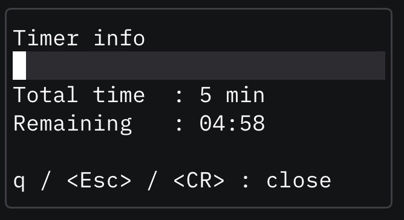
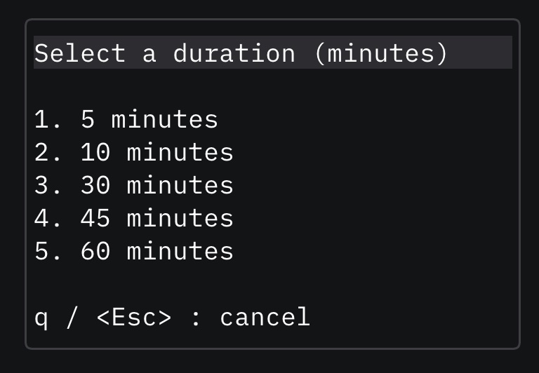

# timer.nvim

Minimal Neovim plugin that lets you start short timers from anywhere inside the editor, pick predefined durations from a centered floating window, and check how much time remains without leaving your buffer.

## Features
- Floating picker that appears in the middle of the screen with configurable durations (`5`, `10`, `30`, `45`, `60` minutes by default).
- Kalan süre popup (`TimerRemaining`) with mm:ss readout.
- Optional notifications when the timer starts or finishes.
- Fully written in Lua, no external dependencies beyond a recent Neovim (0.8+) with `vim.ui` and floating-window support.

## Installation (Lazy.nvim)

```lua
{
  "temelgunaydin/timer.nvim",
  config = function()
    require("timer").setup({
      options = { 5, 10, 30, 45, 60 }, -- customize durations
      open_keymap = "<leader>tt",      -- open picker
      remaining_keymap = "<leader>tr", -- show remaining time popup
    })
  end,
}
```

### Packer.nvim
```lua
use({
  "temelgunaydin/timer.nvim",
  config = function()
    require("timer").setup()
  end,
})
```

## Usage
- `:TimerPick` or the `open_keymap` (default `<leader>tt`) opens the centered picker. Press `1`, `2`, `3`, … or use `<CR>` to start a timer.
- `:TimerRemaining` or `remaining_keymap` (default `<leader>tr`) shows the remaining time popup; close it with `q`, `<Esc>`, or `<CR>`.
- Notifications announce when a timer starts and finishes.

### Configuration Options
| Option              | Type    | Default        | Description                                  |
|---------------------|---------|----------------|----------------------------------------------|
| `options`           | table   | `{5,10,30,45,60}` | List of minute values shown in the picker.   |
| `open_keymap`       | string  | `"<leader>tt"` | Normal-mode mapping to open the picker.      |
| `remaining_keymap`  | string  | `"<leader>tr"` | Mapping to show the remaining time popup.    |
| `keymap`            | string? | `nil`          | Backwards-compatible alias for `open_keymap`.|

Set any value to `false`/`nil` to skip creating that keymap.

## Commands
- `:TimerPick` – open the duration picker.
- `:TimerRemaining` – show remaining time for the active timer.

## Screenshots
<p align="center">
  
</p>

<p align="center">
  
</p>

## Contributing
Bug reports and PRs are welcome.

## License
MIT © Temel Gunaydin

